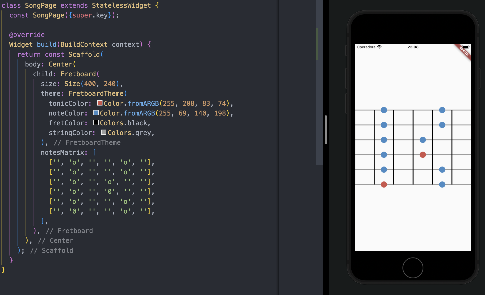

# Fretboard 🎸

[![style: very good analysis][very_good_analysis_badge]][very_good_analysis_link]
[](https://github.com/felangel/mason)
[![License: MIT][license_badge]][license_link]

Song writing toolkit for Flutter.

## Features

* [x] Easily draw a fretboard layout with some note markers.
* [ ] Show the note symbol with a letter notation.
* [ ] Automatically generate a fretboard drawing based on a given scale name.

## Usage

To draw a simple guitar fretboard you can just instantiate the `Fretboard` widget passing some `Size` and a matrix that represents how the fretboard should be drawn:

```dart
class MyCustomWidget extends StatelessWidget {
  const MyCustomWidget({super.key});

  @override
  Widget build(BuildContext context) {
    return Center(
      child: Fretboard(
        size: Size(400, 240),
        notesMatrix: [
          ['', 'o', '', '', 'o', ''],
          ['', 'o', '', '', 'o', ''],
          ['', 'o', '', 'o', '', ''],
          ['', 'o', '', '0', '', ''],
          ['', 'o', '', '', 'o', ''],
          ['', '0', '', '', 'o', ''],
        ],
      ),
    );
  }
}
```



## Advanced usage

### Custom theme

You can change the default theme colors by passing a custom `FretboardTheme`:

```dart
Fretboard(
  size: Size(400, 240),
  theme: FretboardTheme(
    tonicColor: Colors.green,
    noteColor: Colors.pink,
    fretColor: Colors.grey,
    stringColor: Colors.black,
  ),
  notesMatrix: [
    ['', 'o', '', '', 'o', ''],
    ['', 'o', '', '', 'o', ''],
    ['', 'o', '', 'o', '', ''],
    ['', 'o', '', '0', '', ''],
    ['', 'o', '', '', 'o', ''],
    ['', '0', '', '', 'o', ''],
  ],
),
```

## Dart Versions

* Dart 3 >= 3.0.0

## Maintainers

* [Pedro Zaroni](https://github.com/mugbug)
